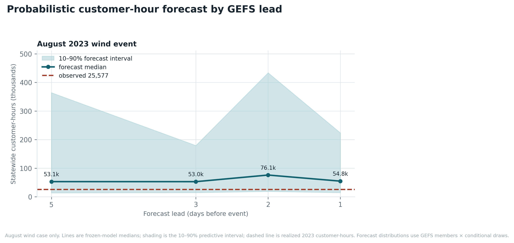
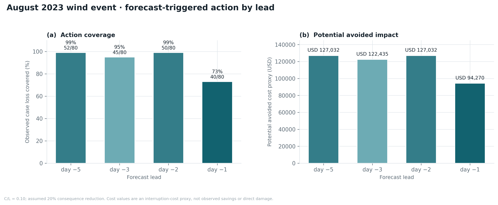

<div align="center">

# Storm-Driven Outage Risk and Forecast Value over Michigan

**A probabilistic county-day framework linking reanalysis weather to distribution-system
outage occurrence, consequence, and restoration — and to the operational value of
ensemble forecasts.**

Abdullah Al Fahad · NASA Goddard Space Flight Center


### Preprint

**[Read the PDF](preprint/storm_outage_risk_michigan_preprint.pdf)**&nbsp; · &nbsp;[LaTeX source](preprint/)

*12 pages. Frozen model, 2023 holdout scored once. Not peer reviewed.*

</div>

---

## Abstract

Distribution-system power outages are the weather impact that electricity customers
actually experience, yet the operational question — *how much consequence should we
expect in each county, and is a forecast good enough to act on?* — is rarely answered
probabilistically. This repository implements a reproducible, end-to-end framework that
links ERA5 reanalysis and GEFS ensemble forecasts to county-day outage records from
EAGLE-I across Michigan, 2018–2023.

A three-part hurdle model estimates **(i)** the probability that a county-day experiences
an outage event, **(ii)** the conditional distribution of customer-hours lost, and
**(iii)** the conditional restoration duration. Monte Carlo composition combines the three
into a full predictive distribution of consequence that preserves zero inflation and heavy
tails. The model was frozen on pre-2023 data and scored **once** on the 2023 holdout, where
it outperforms county climatology, a logistic GLM, and a gust-threshold rule, and retains
positive magnitude skill. Two 2023 GEFS case studies show how that skill behaves across
forecast lead times, and a cost–loss analysis translates calibrated probabilities into the
decision value of acting on a forecast.

The framework estimates **outage occurrence, consequence, and restoration**. It is *not*
an asset-fragility or physical damage model. It is region-portable: a single
`config/region.yaml` moves it to another state.

### Highlights

| | 2023 holdout result |
|---|---|
| **Occurrence skill** | Brier **0.0795**, beating county climatology (0.0859), a logistic GLM (0.0840), and a gust > 20 m/s rule (0.1118) |
| **Magnitude skill** | CRPS skill vs climatology **+0.084**; full predictive distribution of customer-hours, not a point estimate |
| **Restoration skill** | Concordance **0.619**; median absolute error **5.22 h** |
| **Forecast value** | At a −5-day GEFS lead, triggered counties contained **99%** of realized event loss |
| **Reproducibility** | One frozen split, one test evaluation, `make`-driven pipeline with Slurm job chain |

### About the preprint

`preprint/` holds the paper, its LaTeX source, a verified bibliography, and a Makefile.
`main.tex` reads its figures from `figures/` rather than carrying copies, so
`cd preprint && make` always rebuilds against whatever `make phase2-report` last wrote —
the PDF cannot drift from the artifacts it reports. Every result value in the paper is
transcribed from [`docs/phase2_results.md`](docs/phase2_results.md), and the built PDF is
diffed back against that source before release.

### Contents

[1. Workflow](#1-workflow) · [2. Data and features](#2-data-and-county-day-features) ·
[3. Model](#3-probabilistic-risk-model) · [4. Experimental design](#4-experimental-design-and-safeguards) ·
[5. Results](#5-results) · [6. Forecast value and economics](#6-forecast-value-and-economic-interpretation) ·
[7. Reproducing the analysis](#7-reproducing-the-analysis) · [8. Limitations](#8-limitations) ·
[9. Provenance](#9-data-provenance) · [Citation](#citation)

---

## 1. Workflow


> **Figure 1.** Methods schematic. Inputs are aggregated to county-day features, a three-part
> probabilistic model produces county risk, and Monte Carlo composition feeds the
> decision-value analysis. The maps, curves, density shapes, and annotated medians in this
> figure *illustrate the analysis design*; the empirical results are the metric tables and
> generated figures in [Section 5](#5-results).

---

## 2. Data and county-day features

| Source | Role in the analysis |
|---|---|
| **EAGLE-I** (ORNL) | Hourly county outage records; event construction and outage consequence |
| **MCC** | Customer denominators for each county |
| **ERA5** (ECMWF/C3S) | Hourly reanalysis: wind, gust, precipitation, temperature, soil moisture, CAPE, snow |
| **TIGER/Line** (Census) | County geometry for equal-area spatial aggregation |
| **NLCD tree canopy** (MRLC) | Broad exposure proxy — *not* vegetation-management condition |
| **GEFS** (NOAA) | Ensemble forecasts driving the two 2023 case studies |

**Spatial aggregation.** ERA5's 0.25° grid is aggregated to counties in equal-area
**EPSG:5070**. Smooth fields use area-weighted means; localized hazards use spatial maxima,
because a county-mean gust destroys the damage signal.

**Daily features.** Maximum gust, precipitation totals, threshold-exceedance hours,
antecedent wetness, freezing-rain and wet-snow proxies, canopy interactions, and seasonal
indicators.

---

## 3. Probabilistic risk model

For county $c$ and day $t$ the model estimates a **predictive distribution**, not a
deterministic warning and not a physical asset-failure probability.

| Stage | Target | Estimator |
|---|---|---|
| **1 · Occurrence** | $p_{ct} = P(Y_{ct} = 1 \mid X_{ct})$ | LightGBM with isotonic probability calibration |
| **2 · Magnitude** | Conditional distribution of customer-hours | NGBoost in log space; LightGBM quantiles as fallback |
| **3 · Restoration** | Conditional restoration duration | Weibull AFT, with Cox proportional-hazards diagnostics |

**Monte Carlo composition** draws occurrence, conditional magnitude, and duration jointly.
This is what preserves zero inflation, heavy tails, and the uncertainty that the
customer-hour and decision-value calculations depend on.

### Verification language

| Metric | What it measures |
|---|---|
| **Brier score** | Squared error of event probabilities (lower is better) |
| **Brier skill** | Brier score relative to *county* climatology; positive means improvement over that reference |
| **Average precision · ROC AUC** | Rare-event *ranking* — not calibration |
| **CRPS** | Quality of a full predictive distribution (lower is better) |
| **PIT / rank histograms** | Ensemble dispersion diagnostics |
| **Concordance · MAE** | Restoration-duration performance |

Validation reliability curves use **out-of-fold** calibrated probabilities. Storm-blocked,
leave-one-county-out, and forward-year folds are retained to limit leakage from correlated
weather and outage observations.

---

## 4. Experimental design and safeguards

| Period | Role |
|---|---|
| 2018-01-01 → 2022-06-30 | Model fitting |
| 2022-07-01 → 2022-12-31 | Calibration and validation |
| 2023-01-01 → 2023-12-31 | **One-time** final test |

- All timestamps are **UTC**; county–grid weights are computed in an equal-area CRS.
- **No 2023 outcome** is used for tuning, calibration, bias correction, or model selection.
- The earlier January–May 2021 retrospective is **superseded**, because 2021 is now training
  data; forward-year cross-validation is the appropriate temporal diagnostic.

---

## 5. Results

The frozen model was fit on January 2018–June 2022, calibrated and verified on July–December
2022, and scored **once** on the full 2023 holdout. The 2023 column is the primary result;
validation is shown for context.

### 5.1 Occurrence

**Table 1.** Occurrence verification. Bold is the 2023 holdout.

| Metric | Better | Validation | 2023 test |
|---|:--:|---:|---:|
| Brier score | ↓ | 0.0926 | **0.0795** |
| Brier skill vs county climatology | ↑ | +0.101 | **+0.075** |
| Average precision | ↑ | 0.339 | **0.277** |
| ROC AUC | ↑ | 0.753 | **0.746** |
| Log loss | ↓ | 0.3196 | **0.2838** |
| *Reference:* logistic GLM (Brier) | ↓ | 0.0999 | **0.0840** |
| *Reference:* county climatology (Brier) | ↓ | 0.1030 | **0.0859** |
| *Reference:* gust > 20 m/s rule (Brier) | ↓ | 0.1418 | **0.1118** |

The frozen occurrence model outperformed **all three** references on Brier score.

### 5.2 Magnitude and restoration

**Table 2.** Consequence and restoration verification.

| Metric | Better | Validation | 2023 test |
|---|:--:|---:|---:|
| Magnitude CRPS (customer-hours) | ↓ | 16,011 | **39,164** |
| Magnitude CRPS skill vs climatology | ↑ | +0.083 | **+0.084** |
| Magnitude log score | ↓ | 9.242 | **9.003** |
| Magnitude median RMSE | ↓ | 146,422 | **501,575** |
| Restoration concordance | ↑ | 0.663 | **0.619** |
| Restoration median MAE (hours) | ↓ | 4.42 | **5.22** |
| *Reference:* county persistence MAE (hours) | ↓ | 4.57 | **4.20** |

Magnitude skill remained positive, while the larger 2023 magnitude error and the lower
restoration concordance mark where uncertainty is greatest.

### 5.3 GEFS 2023 case studies

These are **separate operational forecast evaluations** of the frozen model. They do not
replace the year-long test.

**Table 3.** Statewide customer-hour forecasts by lead, two 2023 cases.

| Case | Lead | Median | 10–90% interval | Observed | Meteorological variance |
|---|---:|---:|---:|---:|---:|
| Aug 2023 wind event | day −5 | 53,113 | 13,677–364,016 | 25,577 | 9.6% |
| Aug 2023 wind event | day −3 | 52,981 | 14,710–179,218 | 25,577 | 11.1% |
| Aug 2023 wind event | day −2 | 76,129 | 18,787–433,563 | 25,577 | 26.8% |
| Aug 2023 wind event | day −1 | 54,824 | 14,710–223,482 | 25,577 | 36.0% |
| Feb 2023 ice storm | day −5 | 2,454 | 0–15,818 | 38,402 | 11.5% |
| Feb 2023 ice storm | day −3 | 4,272 | 0–20,890 | 38,402 | 18.1% |
| Feb 2023 ice storm | day −2 | 3,184 | 0–14,660 | 38,402 | 9.0% |
| Feb 2023 ice storm | day −1 | 3,462 | 0–16,146 | 38,402 | 6.7% |

**All** August wind-event intervals contained the observation. **Every** February ice-storm
interval fell below it — a case-specific underprediction that should guide future
hazard/magnitude diagnostics.



> **Figure 2.** August 2023 wind event by lead time. Teal line: forecast median. Shading:
> 10–90% predictive interval. Dashed line: the 25,577 customer-hours that actually occurred.

### 5.4 Publication figures

PNGs are the GitHub-visible versions; matching **vector PDFs** are produced by the reporting
job for manuscript use.


> **Figure 3.** Frozen-model skill summary — reliability, precision–recall, magnitude PIT,
> reference models, hazard regimes, and cross-validation.


> **Figure 4.** County-level diagnostics — event rate, forecast probability, bias, Brier
> skill, event count, and magnitude CRPS.


> **Figure 5.** GEFS forecast distributions for both 2023 case studies across four leads.


> **Figure 6.** ERA5 hazard fields on the two case-study days.


> **Figure 7.** Relative economic value across cost–loss ratios.

**Complete generated record:** [Phase 2 result memo](docs/phase2_results.md) ·
[GitHub-readable technical memo](docs/phase2_technical_memo.md). The animated HTML memo is
retained for local/browser review; GitHub does not execute its JavaScript.

---

## 6. Forecast value and economic interpretation

The model's loss unit is the **customer-hour**: one customer without service for one hour.
The configured interruption-cost proxy is **USD 25.12 per customer-hour**, from 88%
residential at USD 4.00 plus 12% commercial at USD 180.00.

> [!IMPORTANT]
> This is a **documented placeholder** based on the current residential/commercial mix — not
> measured Michigan damage, repair expense, or utility financial loss. Every dollar figure
> below is a counterfactual scenario, not an observed saving. Direct asset damage and
> realized action value require utility-specific asset, action-cost, work-order, and
> intervention-outcome data.

Forecast value is evaluated two complementary ways:

- **Dimensionless cost–loss value.** Act when calibrated probability exceeds the cost–loss
  threshold $C/L$, then compare forecast decisions against climatology and perfect
  information across the configured cost–loss ratios.
- **Action-impact scenarios.** Identify counties triggered by the selected probability
  threshold, report the observed loss covered by those counties, and apply an explicit
  mitigation-effectiveness assumption to estimate potential avoided customer-hours and cost
  proxy.

### 6.1 Forecast-triggered impact by lead

At the configured $C/L = 0.10$ threshold and a 20% consequence-reduction scenario, the
August wind forecast would have covered the realized loss below. February's ice-storm rows
are omitted because no counties crossed the trigger and the potential avoided proxy was zero.

**Table 4.** August 2023 wind event — potential avoided impact by lead (*not* observed savings).

| Forecast lead | Counties triggered | Observed loss covered | Potential avoided customer-hours | Potential avoided cost proxy |
|---|---:|---:|---:|---:|
| −5 days | 52/80 | 99% | 5,057 | **$127,032** |
| −3 days | 45/80 | 95% | 4,874 | **$122,435** |
| −2 days | 50/80 | 99% | 5,057 | **$127,032** |
| −1 day | 40/80 | 73% | 3,753 | **$94,270** |

### 6.2 How the loss-prevention estimate is constructed

1. **Forecast risk by county.** At each GEFS lead, the model produces an outage probability
   $p_i$ and a conditional customer-hour distribution for county $i$.
2. **Trigger an action.** A county is flagged when calibrated probability exceeds the
   selected cost–loss threshold, $p_i \ge C/L = 0.10$. At a −5-day lead, **52 of 80**
   counties crossed that threshold.
3. **Define the action package.** Depending on lead time: pre-position crews and materials,
   request mutual aid, inspect vulnerable circuits, clear vegetation, prepare switching
   plans, and communicate with customers.
4. **Measure loss covered.** After the event, the trigger mask is compared with observed
   outages. At −5 days, total observed loss was 25,577 customer-hours; triggered counties
   contained 25,285 customer-hours — **99%** of event loss.
5. **Apply a mitigation assumption.** Intervention records are unavailable, so the memo
   assumes actions reduce realized consequence by 20%:

   $$\text{avoided customer-hours} = 25{,}285 \times 0.20 = 5{,}057$$

6. **Convert to the cost proxy.**

   $$5{,}057 \times 25.12\ \text{USD/customer-hour} \approx \text{USD } 127{,}032$$

So the −5-day forecast could have supported actions covering nearly all observed outage
loss, with a modeled potential reduction of about 5,057 customer-hours, or \$127,032. These
are counterfactual potential benefits; actual net benefit requires utility-specific action
costs and intervention outcomes.



> **Figure 8.** Forecast-triggered action by lead — observed loss coverage and potential
> avoided interruption-cost proxy.

---

## 7. Reproducing the analysis

### Repository layout

```text
config/     region.yaml (the only file to edit for a new region) + phase controls
src/        numbered Phase 1 steps, phase2_* modules, shared code in src/common/
slurm/      the Phase 2 job chain (download → build → train → apply → final test)
tests/      pytest assertions and the miniature end-to-end fixture
docs/       runbooks, result memos, technical memo
figures/    300-dpi PNGs and vector PDFs written by the reporting job
env/        conda environment.yml and pinned pip requirements
```

### Commands

Once inputs are cached and the model is frozen:

```bash
make phase2                 # build through 2022, then train and validate
make phase2-apply           # composition, GEFS cases, decision value, report
make phase2-build-test      # open and build 2023 — only once decisions are frozen
make phase2-test            # score the frozen model on 2023, exactly once
make phase2-techmemo        # HTML + GitHub Markdown memo
```

The final-test Slurm job runs the report and both memo formats automatically. The report
writes `phase2_results_matrix.csv`, `phase2_gefs_case_matrix.csv`, `phase2_county_skill.csv`,
300-dpi PNGs, vector PDFs, and the Markdown/HTML technical memos. Commit the reviewed
Markdown memo and the `figures/phase2_*.png` files when publishing results.

Operational runbook, environment setup, gate criteria, and artifact checks:
**[`docs/PHASE2_RUNBOOK.md`](docs/PHASE2_RUNBOOK.md)**.

---

## 8. Limitations

- **Spatial resolution of the target.** County aggregation hides feeder topology, asset age,
  conductor type, local vegetation management, and utility operations.
- **Consequence, not mechanism.** EAGLE-I records what customers experienced, not why.
- **Hazard resolution.** ERA5 can under-resolve convective gusts at 0.25°.
- **Case-study sample.** GEFS bias correction is limited by the small number of available
  cases.
- **Economics.** The interruption-cost and asset-count assumptions are placeholders and must
  be replaced before any external economic claim.

---

## 9. Data provenance

| Dataset | Source |
|---|---|
| EAGLE-I outage records | ORNL / figshare — [`10.6084/m9.figshare.24237376`](https://doi.org/10.6084/m9.figshare.24237376) |
| ERA5 reanalysis | Copernicus Climate Data Store and ECMWF ARCO |
| GEFS ensemble forecasts | NOAA public cloud archive |
| NLCD tree canopy | MRLC |
| County geometry | U.S. Census TIGER/Line |
| Interruption-cost framing | LBNL/DOE ICE Calculator framework |

---

## Citation

```bibtex
@software{alfahad_storm_outage_risk_mi,
  author  = {Al Fahad, Abdullah},
  title   = {Storm-Driven Outage Risk and Forecast Value over Michigan:
             a probabilistic county-day framework},
  url     = {https://github.com/afahadabdullah/storm-outage-risk-mi},
  note    = {NASA Goddard Space Flight Center}
}
```
