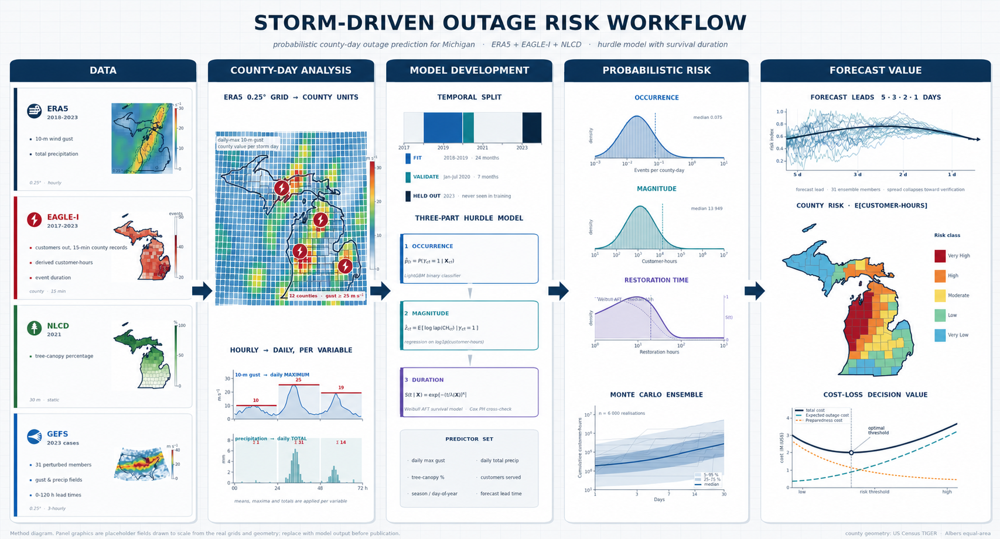

# Storm-Driven Outage Risk and Forecast Value — Michigan

This repository develops a probabilistic, county-day framework for estimating
electricity-distribution outage consequence from weather hazards and for
quantifying the operational value of real forecast ensembles. The study area is
Michigan; the outcome is customer outage consequence, not asset fragility or
the physical cause of damage.

## Scientific objective

The project asks two linked questions:

1. Given observed weather, what is the distribution of outage occurrence,
   customer-hours, and restoration time for each county-day?
2. Given an ensemble forecast, how does advance knowledge of that distribution
   change a cost-sensitive preparation decision?

The analysis preserves uncertainty throughout. It models outage occurrence,
magnitude, and restoration as separate distributions, composes them by Monte
Carlo simulation, and reports risk and decision value rather than a single
deterministic outage estimate.

## Workflow



Historical hazards and outage records are converted from hourly gridded and
county data into a common county-day table. The frozen core temporal design
fits on January 2018–June 2022, calibrates and validates on July–December 2022,
and reserves all of 2023 for a single final evaluation. GEFS ensemble forecasts
then drive two 2023 frozen-model case studies at lead days 5, 3, 2, and 1.

The workflow image is a method schematic: its maps, curves, density shapes,
and annotated medians illustrate the types of inputs and outputs, rather than
empirical estimates from a completed run. Replace those panel graphics with
generated model output before using the figure to report results.

For a detailed interpretation of the model, verification metrics, risk terms,
and current economic assumptions, see the
[atmospheric-science overview](docs/ATMOSPHERIC_SCIENTIST_OVERVIEW.md).

## Data

| Data product | Coverage | Role in the analysis |
|---|---|---|
| EAGLE-I county outage records | 2017–2023 | Hourly outage consequence and event construction; 2017 supplies baseline context. |
| Monthly County Customer (MCC) data | Available reporting years | Customer denominator for outage fractions and customer-hours. |
| ERA5 hourly reanalysis | 2018–2023, Michigan bbox | Historical wind, gust, precipitation, temperature, soil, convective, and snow predictors. Seven fields are read from ECMWF ARCO; five residual fields are retrieved from CDS. |
| TIGER/Line counties | 2023 geography | County geometry and land area for spatial aggregation and exposure features. |
| NLCD tree canopy | 2021 | County canopy exposure and weather–vegetation interactions. |
| GEFS ensemble forecasts | Two 2023 case studies | Forecast scenarios for lead-time, calibration, and decision-value analysis. |
| ICE Calculator inputs | Study assumptions | Interruption-cost inputs for cost-loss and value-of-information calculations. |

## Methods

### Outcome construction

Outage records are normalized to UTC and converted to county-hour maxima.
Customer outages are divided by MCC denominators. A rolling 30-day, 10th
percentile baseline separates excess outage from routine background activity;
contiguous excess periods form outage events.

### Weather and spatial features

ERA5 fields are aggregated from a 0.25° grid to counties in the equal-area
EPSG:5070 coordinate system. Area-weighted means represent smooth fields such
as precipitation, soil moisture, and temperature. Spatial maxima represent
tail hazards such as gust and CAPE. Daily features include gust thresholds,
precipitation totals, freezing-rain and wet-snow proxies, antecedent
precipitation, canopy interactions, and seasonal indicators.

### Probabilistic outage model

Three linked models estimate:

- **Occurrence:** probability of any outage event on a county-day.
- **Magnitude:** conditional distribution of customer-hours.
- **Restoration:** conditional duration of an outage event.

The three distributions are sampled jointly through Monte Carlo composition to
produce a county-level distribution of customers affected, customer-hours, and
cost. Calibration and storm-aware cross-validation evaluate the models without
treating nearby days from the same storm as independent evidence.

### Earlier split experiment

An earlier frozen split produced a Jan–May 2021 retrospective diagnostic. That
record is retained in [the archived 2021 results](docs/phase2_backtest_2021_results.md),
but 2021 is now part of the enlarged training window and those scores are not
independent evidence for the retrained model. Temporal generalization before
the final test is assessed with forward-year cross-validation.

### Forecast and decision analysis

For the two 2023 case studies, GEFS members provide day-5, day-3, day-2, and
day-1 forecast scenarios. Forecast features are aligned with the historical
feature definitions and bias-corrected before the trained risk model is
applied. The resulting predictive distributions feed a cost-loss calculation
that compares preparation costs, expected outage costs, break-even inspection
costs, and the value of perfect information.

## Scientific safeguards

- **One time standard:** all timestamps are converted to UTC at ingestion.
- **Geographically valid aggregation:** county-grid weights are calculated in
  an equal-area CRS rather than latitude/longitude degrees.
- **No test-year tuning:** 2023 is reserved for final evaluation after model
  choices are fixed from the earlier years.
- **Distributional predictions:** uncertainty from occurrence, magnitude, and
  duration is propagated rather than collapsed into point estimates.
- **Event-aware validation:** storm-grouped and county-aware folds reduce
  leakage from correlated weather and outage observations.

## Outputs

The repository produces reproducible county-hour and county-day tables,
event records, calibrated validation metrics, fitted model bundles, probabilistic
outage-risk scenarios, forecast maps, and decision-economic summaries. The
workflow is designed so that every intermediate artifact can be inspected,
validated, and regenerated from configuration and raw inputs.

`make phase2-report` turns the frozen run artifacts into a validation/test
metric matrix, a GEFS case-by-lead verification matrix, and matching 300-dpi PNG
and vector PDF figures for publication.

## Results package

### Final 2023 test at a glance

The frozen model was scored once on the full 2023 holdout. Occurrence skill was
maintained out of sample: the Brier score was **0.0795** (Brier skill **+0.075**
relative to county climatology), compared with **0.0840** for the logistic GLM,
**0.0859** for county climatology, and **0.1118** for the gust-threshold rule.
Average precision was **0.277** and ROC AUC was **0.746**. Conditional magnitude
CRPS was **39,164 customer-hours** (skill **+0.084** relative to climatology),
while restoration concordance was **0.619** with **5.22 h** median absolute
error. These figures are the 2023 result, not the earlier validation period.

The GEFS case studies demonstrate why the annual test and operational cases are
reported separately. For the August wind event, all four lead-time 10–90%
intervals contained the observed 25,577 customer-hours. For the February ice
storm, every lead-time interval was below the observed 38,402 customer-hours;
that underprediction is a case-specific diagnostic, not a replacement for the
year-long verification.

Economic outputs convert customer-hours to a configured interruption-cost
proxy and evaluate forecast-triggered mitigation scenarios. They are not direct
estimates of utility asset damage, repair expense, or realized savings: those
require utility-specific asset, action-cost, and intervention-effectiveness
data. The memo makes that distinction explicit for every dollar value.

After each frozen run, `make phase2-techmemo` builds a concise, animated
[animated technical memo](docs/phase2_technical_memo.html) and a
[GitHub-readable Markdown memo](docs/phase2_technical_memo.md) from the same
result matrices and figures used for reporting. It begins with the study split and abstract,
then presents reference-model skill, GEFS case-study verification, decision
value, county diagnostics, and a short conclusion. Values are inserted from
the generated artifacts rather than copied into this README, preventing a
stale narrative when the final 2023 test replaces validation-only results.

GitHub renders the Markdown memo and committed PNG figures directly. It does
not execute JavaScript in repository HTML, so the animated HTML is intended
for local/browser viewing; use the Markdown memo as the canonical link from
GitHub.

The accompanying [results matrix](docs/phase2_results.md) remains the
publication record: it identifies whether 2023 is still sealed and lists every
reported metric, GEFS lead, and uncertainty diagnostic. The technical memo is
generated locally with its figures; commit the Markdown memo and the reviewed
`figures/phase2_*.png` files when releasing a GitHub-visible results package.

## Repository guide

```text
config/       study geography, temporal splits, data sources, and model controls
data/         raw, interim, and processed artifacts
docs/         runbooks, methodological notes, and workflow figures
env/          reproducible environment specifications
slurm/        CPU Slurm jobs for downloading, preprocessing, training, and evaluation
src/          ingestion, event construction, feature engineering, modeling, forecasting,
              decision analysis, and shared geospatial utilities
tests/        data-contract, feature, modeling, and workflow assertions
Makefile      reproducible commands and validation targets
```

Create the specified environment and inspect the available reproducible
commands with:

```bash
mamba env create --prefix /panfs/ccds02/nobackup/people/afahad/envs/storm-outage-risk. \
  -f env/environment.yml
conda activate /panfs/ccds02/nobackup/people/afahad/envs/storm-outage-risk.
make test
make help
```

## Limitations

County aggregation hides distribution-network topology and local asset
condition. EAGLE-I records outage consequence rather than causal mechanism, so
the framework is not a fragility model. ERA5 can under-resolve convective gusts
at 0.25°, tree-canopy percentage is not a measure of vegetation-management
condition, and restoration duration also reflects crew logistics. The dataset
does not include asset age, conductor material, inspection history, or
utility-specific operational practices.

## Data provenance

EAGLE-I county outage data are from ORNL/figshare
(`10.6084/m9.figshare.24237376`); ERA5 is provided by the Copernicus Climate
Data Store and ECMWF ARCO; GEFS is accessed through NOAA's public cloud
archive; NLCD tree canopy is from MRLC; county geometry is from the U.S. Census
TIGER/Line program; and interruption-cost assumptions draw on the LBNL/DOE ICE
Calculator.
