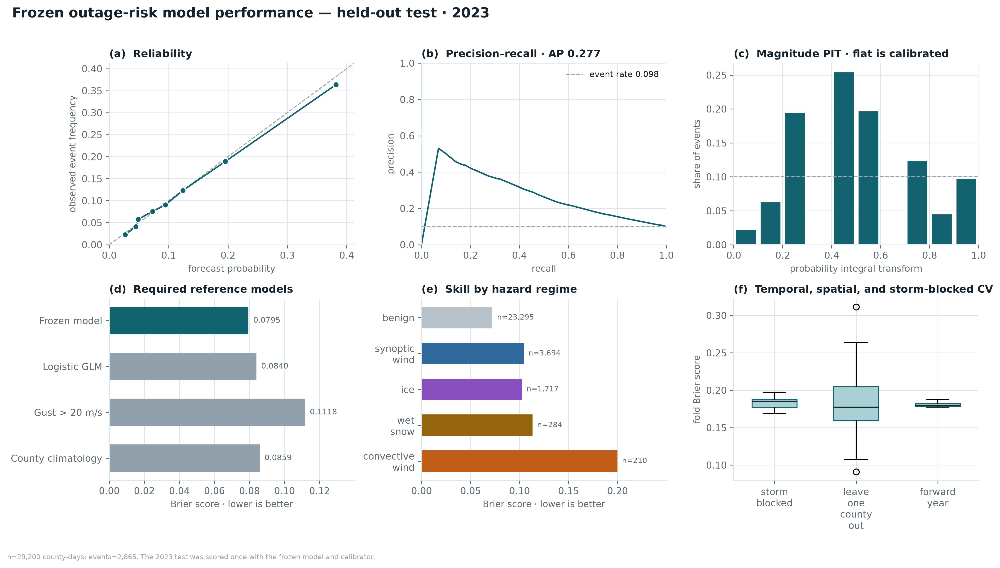
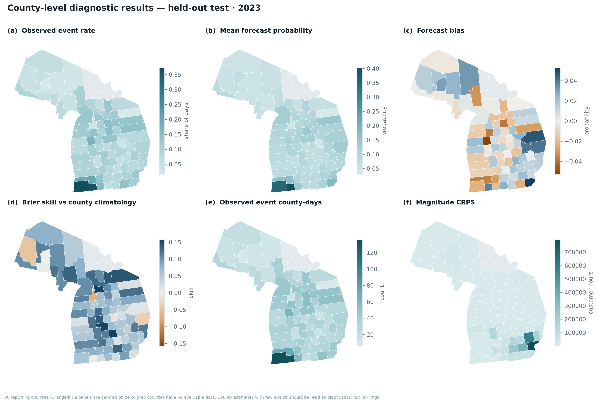
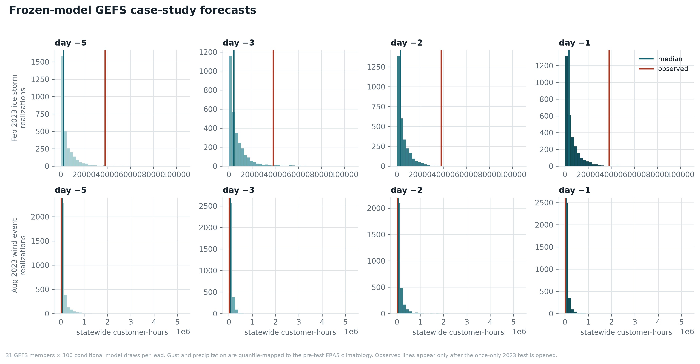
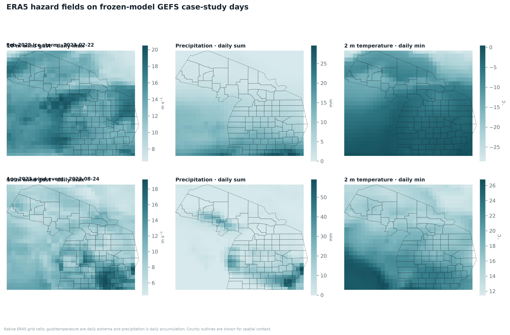
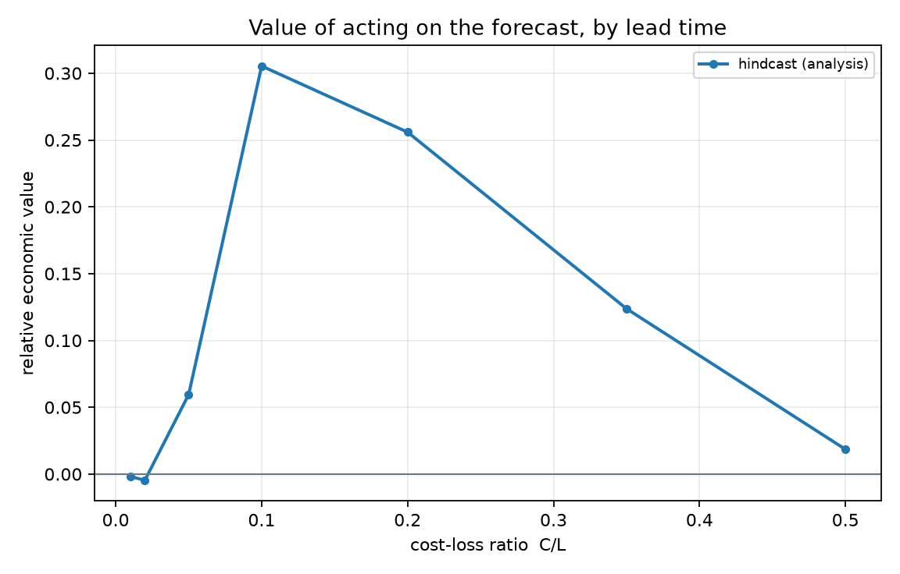

# Storm-driven outage risk and forecast value in Michigan

**Abdullah Al Fahad · NASA Goddard Space Flight Center**

*Final 2023 test scored once*

## Abstract

This short memo reports the frozen Michigan county-day outage-risk model on the full held-out 2023 test. Occurrence Brier score was 0.0795 and average precision was 0.277. Brier skill relative to county climatology was +0.075. All 2023 values were produced after the model and calibrator were frozen.

## Study design

| Period | Dates | Role |
|---|---|---|
| Training | 2018-01-01 to 2022-06-30 | Fit the frozen model |
| Calibration / validation | 2022-07-01 to 2022-12-31 | Select and verify calibration |
| Held-out test | 2023-01-01 to 2023-12-31 | One-time final evaluation |

The occurrence, conditional magnitude, and restoration distributions are composed probabilistically. GEFS drives two separate 2023 case studies and does not replace the annual test.

## Final results

| Metric | Validation | 2023 test |
|---|---:|---:|
| Occurrence Brier score | 0.0926 | 0.0795 |
| Brier skill vs county climatology | +0.101 | +0.075 |
| Average precision | 0.339 | 0.277 |
| ROC AUC | 0.753 | 0.746 |
| Occurrence log loss | 0.3196 | 0.2838 |
| Logistic GLM Brier | 0.0999 | 0.0840 |
| Gust > 20 m/s rule Brier | 0.1418 | 0.1118 |
| County climatology Brier | 0.1030 | 0.0859 |
| Magnitude CRPS (customer-hours) | 16,011 | 39,164 |
| Magnitude CRPS skill vs climatology | +0.083 | +0.084 |
| Magnitude log score | 9.242 | 9.003 |
| Magnitude median RMSE | 146,422 | 501,575 |
| Restoration concordance | 0.663 | 0.619 |
| Restoration median MAE (hours) | 4.42 | 5.22 |
| County persistence MAE (hours) | 4.57 | 4.20 |

## GEFS case studies

The August wind event was contained by all four 10–90% intervals; the February ice-storm observation exceeded every lead-time interval. These are operational case diagnostics, not replacements for annual verification.

| Case | Lead | Median customer-hours | 10–90% interval | Observed | Met. variance |
|---|---:|---:|---:|---:|---:|
| Aug 2023 wind event | day −5 | $53,113 | $13,677–$364,016 | $25,577 | 9.6% |
| Aug 2023 wind event | day −3 | $52,981 | $14,710–$179,218 | $25,577 | 11.1% |
| Aug 2023 wind event | day −2 | $76,129 | $18,787–$433,563 | $25,577 | 26.8% |
| Aug 2023 wind event | day −1 | $54,824 | $14,710–$223,482 | $25,577 | 36.0% |
| Feb 2023 ice storm | day −5 | $2,454 | $0–$15,818 | $38,402 | 11.5% |
| Feb 2023 ice storm | day −3 | $4,272 | $0–$20,890 | $38,402 | 18.1% |
| Feb 2023 ice storm | day −2 | $3,184 | $0–$14,660 | $38,402 | 9.0% |
| Feb 2023 ice storm | day −1 | $3,462 | $0–$16,146 | $38,402 | 6.7% |

## Economic impact and action scenarios

The configured interruption-cost proxy is **$25.12 per customer-hour**. It is not a direct estimate of physical damage, repair expense, or realized savings. Potential avoided impact assumes a forecast-triggered action reduces consequence by 20%.

Across the 2023 test, observed interruption was **126,927,110 customer-hours**, corresponding to **$3,188,409,006** under that configured proxy.

| Case | Observed customer-hours | Interruption-cost proxy | Avoided proxy at 10% / 20% / 30% |
|---|---:|---:|---:|
| Aug 2023 wind event | $25,577 | $642,494 | $64,249 / $128,499 / $192,748 |
| Feb 2023 ice storm | $38,402 | $964,658 | $96,466 / $192,932 / $289,397 |

Forecast-triggered actions use the configured C/L threshold closest to 0.10.

| Case | Lead | Counties triggered | Observed loss covered | Potential avoided proxy |
|---|---:|---:|---:|---:|
| Aug 2023 wind event | day −1 | 40/80 | 73% | $94,270 |
| Aug 2023 wind event | day −2 | 50/80 | 99% | $127,032 |
| Aug 2023 wind event | day −3 | 45/80 | 95% | $122,435 |
| Aug 2023 wind event | day −5 | 52/80 | 99% | $127,032 |

## Publication figures

These static PNGs render directly in GitHub; the companion HTML keeps the animated charts for local/browser review.

### Model skill, calibration, and cross-validation

### County-level diagnostic maps

### GEFS case-study forecast distributions

### ERA5 hazard fields on the two case-study days

### Relative economic value by cost-loss ratio

## Conclusion

The final test evaluates the frozen model over all of 2023. Use the calibrated probabilities and predictive distributions to prioritize preparation, and treat county maps and action savings as diagnostics until utility-specific costs and intervention outcomes are available.

Generated from the frozen Phase 2 artifacts by `make phase2-techmemo`.
